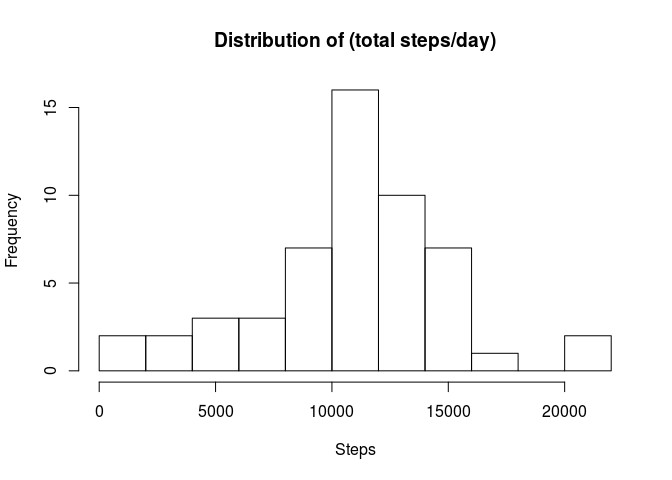
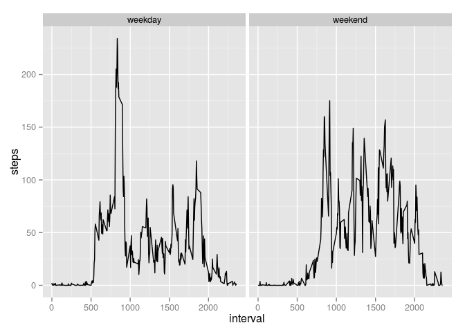

# Reproducible Research: Peer Assessment 1


## Loading and preprocessing the data
1. Calculate the total number of steps taken per day

```r
data = read.csv('activity.csv')
data$date = as.Date(data$date)
```


## What is mean total number of steps taken per day?
Make a histogram of the total number of steps taken each day 

```r
hist(aggregate(steps ~ date, data = data, sum)$steps,
     breaks = 10,
     xlab = "Steps", 
     main = "Distribution of (total steps/day)")
```

 

Calculate and report the mean and median of the total number of steps taken per day 

```r
mean(aggregate(steps ~ date, data = data, sum)$steps)
```

```
## [1] 10766.19
```

```r
median(aggregate(steps ~ date, data = data, sum)$steps)
```

```
## [1] 10765
```


## What is the average daily activity pattern?
Make a time series plot (i.e. type = "l") of the 5-minute interval (x-axis) and the average number of steps taken, averaged across all days (y-axis)

```r
da = aggregate(steps ~ interval, data = data, mean)
plot(da,
     type = "l", 
     main = "Average Daily Activity Pattern", 
     xlab = "time")
```

 

Which 5-minute interval, on average across all the days in the dataset, contains the maximum number of steps?

```r
tail(da[ with(da, order(steps)),], n = 1)
```

```
##     interval    steps
## 104      835 206.1698
```

## Imputing missing values
Calculate and report the total number of missing values in the dataset

```r
sum(is.na(data$steps))
```

```
## [1] 2304
```

Create a new dataset that is equal to the original dataset but with the missing data filled in (I will use the mean for each interval to substitue for NA values).

```r
data2 = data
for (i in which(sapply(data2,is.na))) {
  data2[i,]$steps = da[da$interval == data2[i,]$interval,]$steps
}
```

Make a histogram of the total number of steps taken each day and Calculate and report the mean and median total number of steps taken per day. Do these values differ from the estimates from the first part of the assignment (No, they are fairly close)? What is the impact of imputing missing data on the estimates of the total daily number of steps (Adds weight to the mean and could alter measures of variance artificially)?

```r
hist(aggregate(steps ~ date, data = data2, sum)$steps,
     breaks = 10,
     xlab = "Steps", 
     main = "Distribution of (total steps/day)")
```

 

```r
mean(aggregate(steps ~ date, data = data2, sum)$steps)
```

```
## [1] 10766.19
```

```r
median(aggregate(steps ~ date, data = data2, sum)$steps)
```

```
## [1] 10766.19
```


## Are there differences in activity patterns between weekdays and weekends?
1. Create a new factor variable in the dataset with two levels – “weekday” and “weekend” indicating whether a given date is a weekday or weekend day.

```r
data$wkday = ifelse(grepl('S',weekdays(data$date)),"weekend","weekday")
```

2. Make a panel plot containing a time series plot (i.e. type = "l") of the 5-minute interval (x-axis) and the average number of steps taken, averaged across all weekday days or weekend days (y-axis). 

```r
library(ggplot2)
da2 = aggregate(steps ~ interval + wkday, data = data, mean)
p = ggplot(da2,aes(interval,steps))+geom_line()
p + facet_grid(. ~ wkday)
```

 
